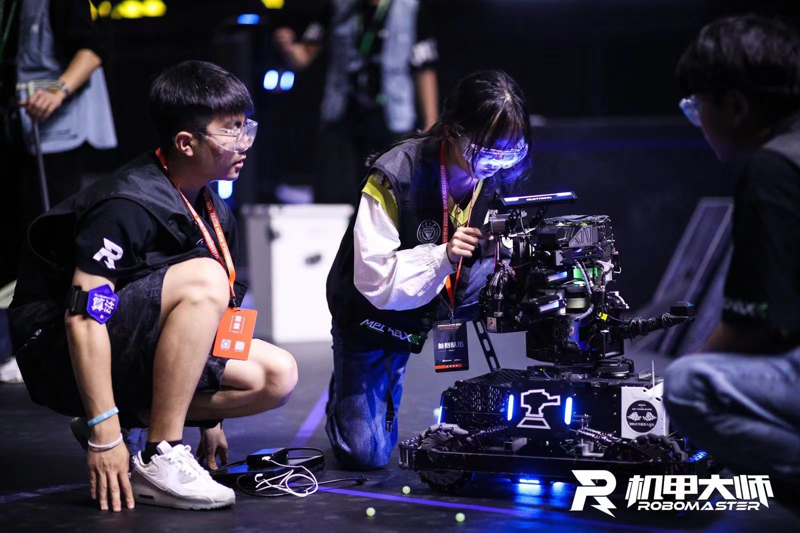
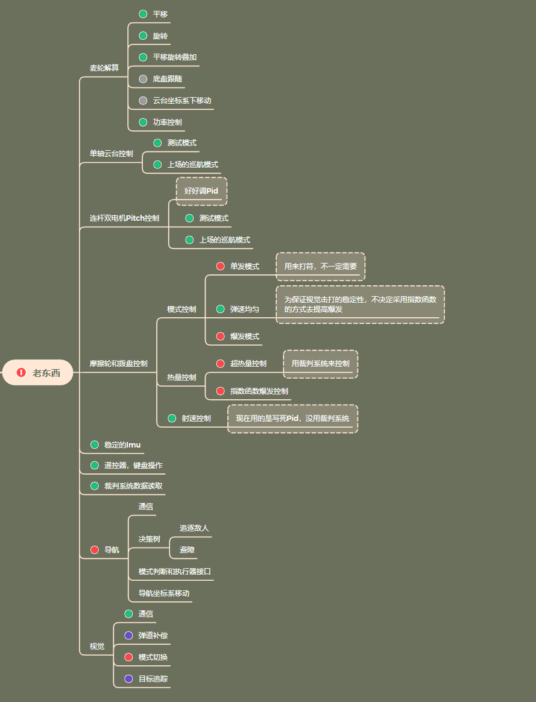
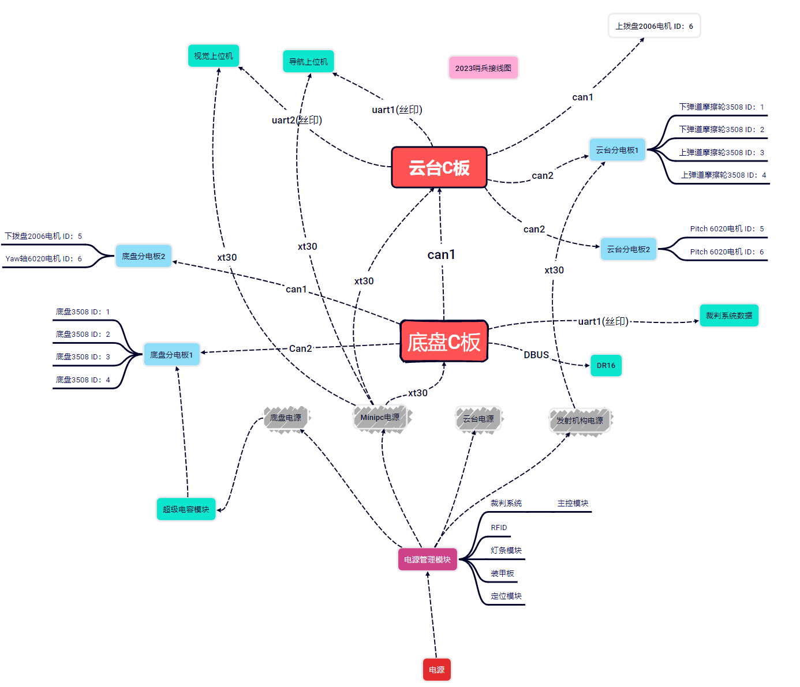

# 2023/2024 Chongqing university Sentry
# 2023哨兵

## 简介
2023哨兵底盘为麦轮结构，在2023对抗赛时期拥有了两个发射机构，一个上供弹，一个下供弹，配备一个nuc和激光雷达Mid360，，2023对抗赛时期拥有自瞄，但无法实现导航。

## 功能
底盘能够实现全向移动，能够实现底盘跟随，小陀螺移动等基本功能，有多层底盘功率控制算法，能够做到利用缓冲能量而不超限；云台和底盘各配备一个C板，能够实现云台的基本功能，如发射，云台控制等，有裁判系统通信，上下位机通信，自瞄等功能，如今已加入新的弹道补偿。下图是2023哨兵功能图纸。

## 缺陷与不足
1.Pitch的重量和连杆结构导致不知名错误，Pitch会时而抖动，找不到原因，只使用一个电机时会有所缓解抖动，但控制力矩不够，稳态误差较大。
2.没有枪口热量的函数控制代码。
3.自瞄在追踪动态目标的效果不好，目前仍在调试中。
4.无法导航，目前仍在调试中。

# 代码部分
##走线

## 底盘C板
所有自己写的东西都存放在/User里面，User下主要有4个文件夹，下面对这4个文件夹分别进行介绍
1.__/AlgorithmLayer__   一些控制函数
2.__/DriverLayer__  硬件自定义配置
3.__/PotocaLayer__  通信函数相关
4.__/Task__ 各种任务

### /AlgorithmLayer
包括PID函数库，电机结构体，IMU驱动函数，裁判系统CRC校验。

### /DriverLayer
包括BMI088启动的自定义硬件配置，自定义的Can通信配置，自定义的usart通信配置(裁判系统和遥控器)。

### /PotocaLayer
rc_potocal.c是遥控器解算函数。
judge.c是裁判系统解算函数，其中包含了取出自定义的裁判系统更新函数，用于做导航决策树。

### /Task
主要任务只有两个：
1.麦轮底盘控制任务
包括：遥控器信息转换，麦轮解算，期望速度限制，功率限制和分配，电机发送。
2.IMU任务
用来读取BMI088的6轴数据并解算出姿态，用的是3号的陀螺仪代码。

### stm32f4xx_it.c
需要指出的是，均将中断调用(除can)写进了stm32f4xx_it.c函数中。

## 云台C板
和底盘C板一样，云台C板的构架也是一样：
1.__/AlgorithmLayer__   一些控制函数
2.__/DriverLayer__  硬件自定义配置
3.__/PotocaLayer__  通信函数相关
4.__/Task__ 各种任务

### /AlgorithmLayer
包括PID函数库，电机结构体，IMU驱动函数，自瞄解算函数，其中包含了Pitch的弹道补偿和对接上位机的解算代码和决策代码。

### /DriverLayer
包括BMI088启动的自定义硬件配置，自定义的Can通信配置(过滤器及接收中断回调)。

### /PotocaLayer
remote_control.c是遥控器解算函数。(注意底盘代码是参考深大的，云台的这个参考官方的)
MX_FREERTOS_init.c是自定义的freertos初始化函数

### /Task
主要任务有5个：
1.Yaw_task 
Yaw轴电机控制任务，反馈值用的IMU航向角，其中有调试模式和上场模式，自带自瞄。

2.Pitch_task
双电机Pitch控制任务，用的其中一个电机进行解算，另一个电机直接赋相同的值(符号相反)。

3.Friction_task
发射机构任务，其中包含4个摩擦轮和两个拨盘，拨盘反转功能由于重写而未验证。

4.INS_task
IMU解算任务，用的3号IMU代码，和底盘C板同款。

5.Exchange_task
通信任务，用来存放了底盘和云台C板通信，自瞄通信的代码。

### stm32f4xx_it.c
需要指出的是，均将中断调用(除can)写进了stm32f4xx_it.c函数中。

**注：很多功能函数都直接放在了任务的文件里面，并没有分配到各个功能文件中去。**